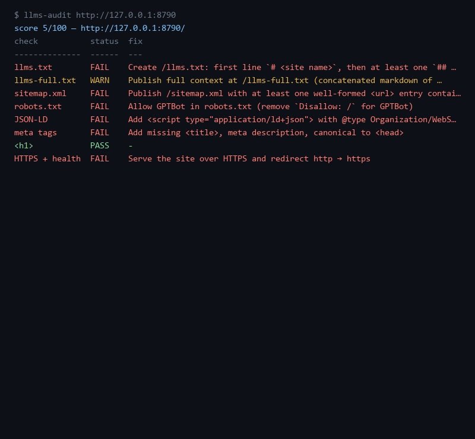

# llms-audit — AI-answer readiness checker

**Audit any site for the AI-answer era: llms.txt, schema, sitemap → score + fix list.**



[](https://github.com/F0Rextasy/llms-audit/actions/workflows/test.yml)
[](LICENSE)
[](https://github.com/F0Rextasy/llms-audit/releases)

## Install

```sh
npm i -g github:F0Rextasy/llms-audit
```

Offline-friendly: once fetched, all checks run locally against the downloaded
HTML/robots/sitemap — no account, no API key, no telemetry.

## 30-second setup

```console
$ llms-audit https://yoursite.com
score 5/100 — http://127.0.0.1:8790/
check           status  fix
--------------  ------  ---
llms.txt        FAIL    Create /llms.txt: first line `# <site name>`, then at least one `## ` section (run with --fix-llms for a template)
llms-full.txt   WARN    Publish full context at /llms-full.txt (concatenated markdown of key pages)
sitemap.xml     FAIL    Publish /sitemap.xml with at least one well-formed <url> entry containing <loc>
robots.txt      FAIL    Allow GPTBot in robots.txt (remove `Disallow: /` for GPTBot)
JSON-LD         FAIL    Add <script type="application/ld+json"> with @type Organization/WebSite/WebPage/Article
meta tags       FAIL    Add missing <title>, meta description, canonical to <head>
<h1>            PASS    -
HTTPS + health  FAIL    Serve the site over HTTPS and redirect http → https
```

Fix what it flags, re-run — an AI-ready page (everything present, HTTP local so
only HTTPS fails) scores:

```console
$ llms-audit http://127.0.0.1:8791
score 85/100 — http://127.0.0.1:8791/
check           status  fix
--------------  ------  ---
llms.txt        PASS    -
llms-full.txt   PASS    -
sitemap.xml     PASS    -
robots.txt      PASS    -
JSON-LD         PASS    -
meta tags       PASS    -
<h1>            PASS    -
HTTPS + health  FAIL    Serve the site over HTTPS and redirect http → https
```

Need the llms.txt boilerplate? It prints one for your host:

```console
$ llms-audit https://acme.test --fix-llms
# Acme
> One-paragraph summary of Acme for AI answers. Replace this line with what the site is and who it serves.

## Products
- [Example item](https://acme.test/): one-line description of the key offering.
```

Flags: `--json` (machine report), `--out report.html` (self-contained dark-mode
report you can attach to a PR), `--timeout ms`, `--fix-llms`.

## How it works

Eight weighted checks (100 points total), fetched once from the target origin:

| check | weight | passes when |
|---|---|---|
| llms.txt | 20 | `# site` heading + ≥1 `## ` section |
| llms-full.txt | 5 | full-context file exists (advisory) |
| sitemap.xml | 15 | parses with ≥1 `<url><loc>` |
| robots.txt | 15 | none of GPTBot, ClaudeBot, Claude-Web, Perplexity-Bot, Google-Extended fully disallowed |
| JSON-LD | 15 | parses; `@type` in Organization/WebSite/WebPage/Article |
| meta tags | 10 | `<title>` + meta description + canonical |
| `<h1>` | 5 | exactly one descriptive heading present |
| HTTPS + health | 15 | https final URL, no redirect loop, status < 400 |

Every FAIL/WARN prints the concrete fix, so the report doubles as a worklist.

### MCP server

`llms-audit --mcp` speaks MCP over stdio and exposes `audit_url {url}` — wire it
into Claude Code, Cursor, or any MCP client:

```json
{"mcpServers": {"llms-audit": {"command": "llms-audit", "args": ["--mcp"]}}}
```

## Comparison

| | llms-audit | open-seo-tool style crawlers | manual checklist |
|---|---|---|---|
| Focus | AI-answer readiness (llms.txt, AI bots, JSON-LD) | classic SEO rank factors | you, a notepad |
| Output | score + per-check fix, HTML/SARIF-ready JSON, MCP | dashboards, accounts | inconsistent |
| Cost | free, offline after fetch | subscription | time |

## Regenerate demo

```sh
python tools/render_demo.py    # spawns fixtures/server.ts (unready + ready), runs the real CLI, rebuilds assets/
```

Fixtures live in `fixtures/server.ts`; every console block above is a real run.

## License

[MIT](LICENSE)
